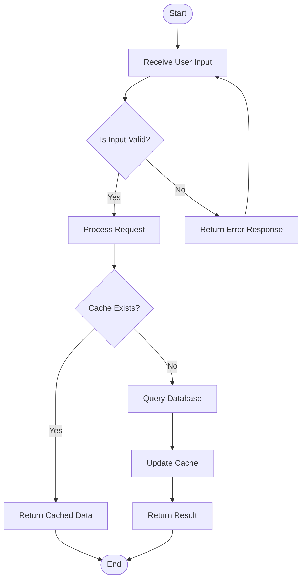
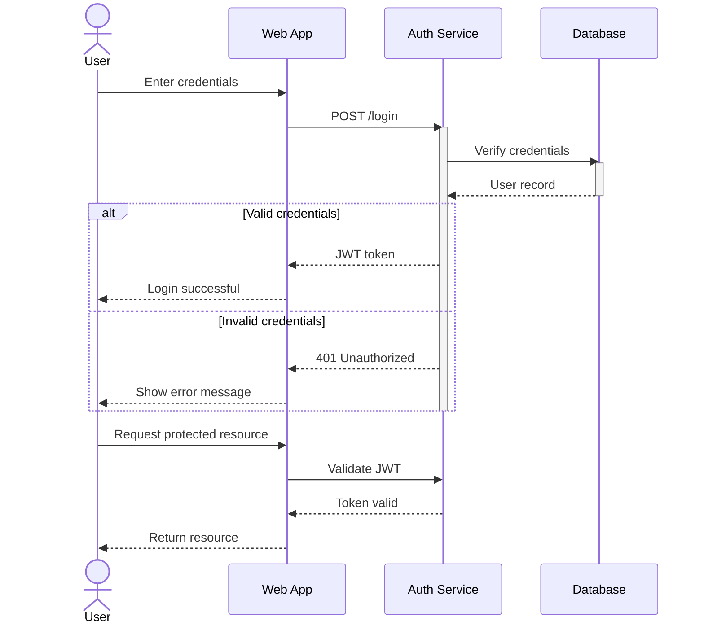
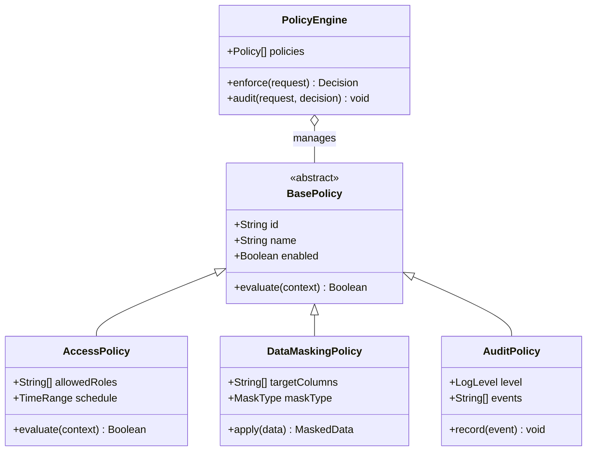
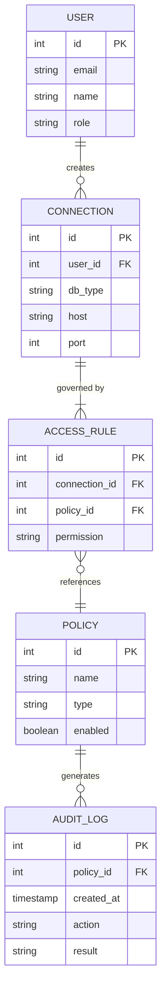
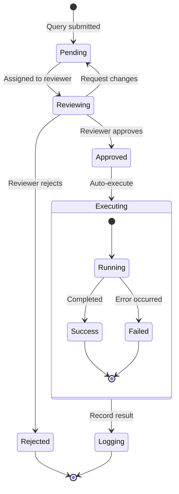
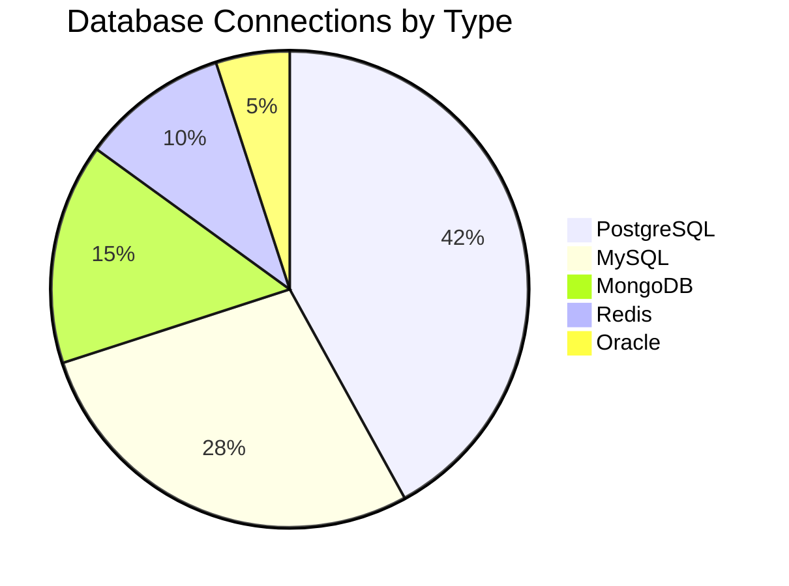
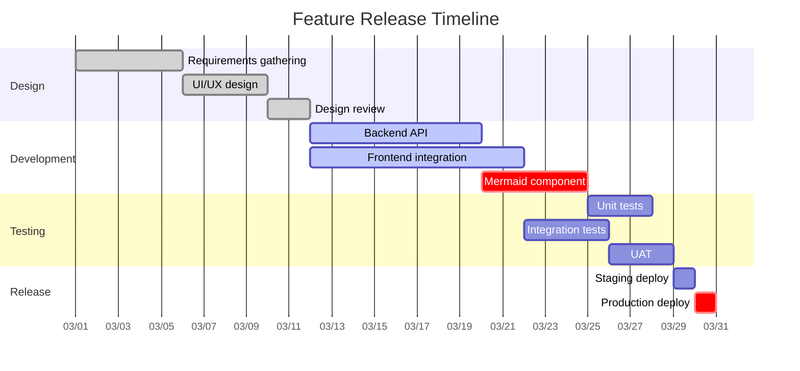

# Overview

[Mermaid](https://mermaid.js.org/) is a JavaScript-based diagramming tool that renders diagrams from text definitions. Write diagrams using a simple syntax inside a fenced code block with the `mermaid` language identifier.

How to write:

````markdown

````

---

# Flowchart

Flowcharts describe processes using nodes and directional edges. Use `graph TD` for top-down or `graph LR` for left-right direction. Nodes can have different shapes: `[rectangle]`, `(rounded)`, `{diamond}`, `([stadium])`, `[[subroutine]]`.

How to write:

````markdown

````

Result:



---

# Sequence Diagram

Sequence diagrams show interactions between participants over time. Use arrows (`->>`, `-->>`) for synchronous and dashed messages, and `activate`/`deactivate` to show lifelines.

How to write:

````markdown

````

Result:


---

# Class Diagram

Class diagrams represent the structure of a system by showing classes, their attributes, methods, and relationships. Use `<|--` for inheritance, `*--` for composition, `o--` for aggregation, and `-->` for association.

How to write:

````markdown

````

Result:


---

# Entity Relationship Diagram

ER diagrams define database schemas and the relationships between entities. Cardinality is expressed using `||` (exactly one), `o|` (zero or one), `}|` (one or more), and `}o` (zero or more).

How to write:

````markdown

````

Result:


---

# State Diagram

State diagrams model the states of a system and transitions between them. Use `[*]` for start/end states and `-->` for transitions with optional labels.

How to write:

````markdown

````

Result:


---

# Pie Chart

Pie charts display proportional data as slices of a circle. Use the `pie` keyword followed by a title and `"label" : value` entries.

How to write:

````markdown

````

Result:


---

# Gantt Chart

Gantt charts visualize project schedules. Define sections, tasks, durations, and dependencies. Tasks can be marked as `done`, `active`, or `crit` (critical).

How to write:

````markdown

````

Result:


